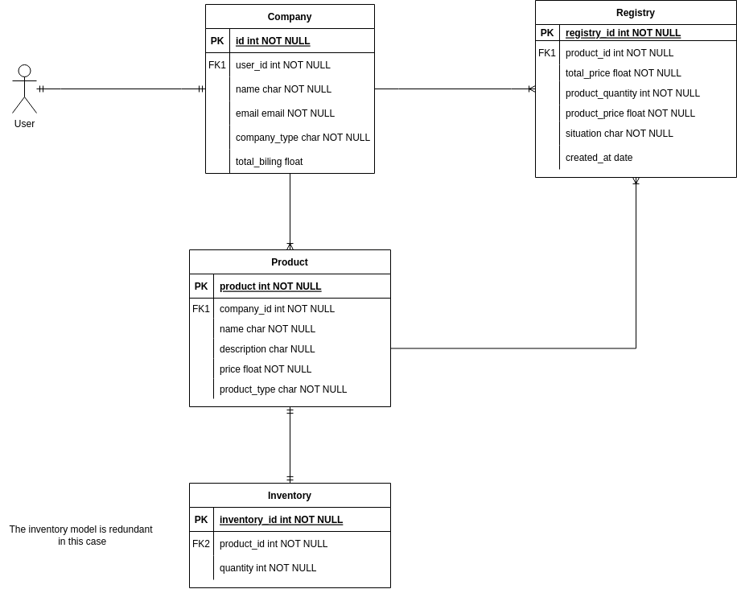

## 🎮 Projeto Final proposto: 
Crie uma API, que possua endpoints para criar e realizar login. Além de endpoints para listar/cadastrar/editar/remover produtos, junto a um endpoint para listar os detalhes do produto assim como seu estoque. Crie um endpoint para listar 
o faturamento da empresa, em que esse endpoint só pode ser acessado pelo dono da empresa.

## 📚 Conceitos estudados: 
FBVs vs CBVs, em síntese CVBs são classes que abstraem a lógica das FBVs. CVBs são 
utilizadas principalmente pela facilidade da reutilização do código já que uma classe pode herdar de outra e ser modificada em diferentes 
casos de uso. FBVs são utilizadas como forma de facilitar o entendimento e a implementação do código, deixando de forma explícita o fluxo do código, 
porém uma desvantagem de usar esse modelo de views é a reutilização do código que precisa ser feita manualmente,dificultando a manutenção e a implementação de novas funcionalidades em grandes projetos.

## 💻 Sobre a API:
A API foi construída utilizando as melhores práticas de construção de uma API moderna, utlizando os princípios <a href="https://en.wikipedia.org/wiki/Representational_state_transfer">REST</a>,
com esforços para que a mesma seja simples, intuitiva e eficiente.

### Explicando o versionamento:
A API conta com duas versões, em que V1 foi construída para 'single use controll', e a sua 
principal característica é a não utilização de endpoints 'públicos', ou seja um usuário só pode visualizar 
ou manipular os recursos ligados ao mesmo, outra caractéristica dessa versão é que foi construída inteiramente com FBVs.
Já a V2 construída utilizando às viewsets recurso disponibilizado 
pela biblioteca DRF, foi adicionado endpoints públicos e protegidos através de permissões customizadas, 
além de outras features como paginação dos dados, filtros e buscas.

| *Versão*  | *Autenticação JWT* | *Paginação* | *Filtros/Buscas* | *Permissões personalizadas* |
| :---: | :---: | :---: | :---: | :---: |  
| **V1**  | Sim  | Não | Não | Sim | 
| **V2** | Sim  | Sim | Sim | Sim |

### Diagrama:

 - Diagrama feito como base no meu entendimento sobre o projeto, desatualizado, devido a algumas alterações, em razão de alguns bugs durante a implementação.

## 🥳 Como rodar o projeto: 
No Linux:
```
# Clone o repositório
git clone git@github.com:Jackson-Vieira/trilha-backend.git
cd trilha-backend

# Crie e ative um ambiente virtual
python3 -m venv venv
source venv/bin/activate

# Instale as dependências
pip install -r requirements.txt 

python3 manage.py runserver
```
#### 🎉 Documentações utilizadas: 
- [Django](https://docs.djangoproject.com/en/4.1/)
- [Django REST framework](https://www.django-rest-framework.org/)